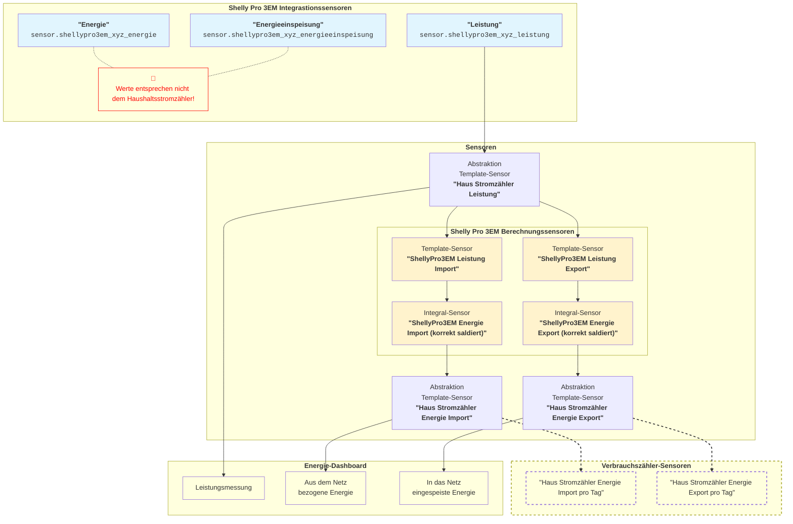

# Shelly Pro 3EM in Home Assistant

- ### Shelly Pro 3EM Energiesaldierung

  Der Shelly Pro 3EM stellt einen korrekten Leistungswert bereit, der in Home Assistant direkt verwendet werden kann.

  Die Energiesaldierung berechnet der Shelly Pro 3EM jedoch _phasenweise_ und nicht _phasenübergreifend_ wie ein typischer Haushaltsstromzähler. Dadurch entstehen systembedingt abweichende Import‑ und Exportenergiewerte, die nicht der offiziellen Messlogik des Netzbetreibers entsprechen.

  Um Energiewerte zu erhalten, die dem Haushaltsstromzähler entsprechen, müssen diese in Home Assistant neu berechnet werden. Der Leistungswert bleibt unverändert und dient als korrekte Grundlage für die phasenübergreifende Energieintegration.

- ### Abstraktionssensoren

  Um ein langfristig stabiles Messsystem in Home Assistant zu erhalten, werden Abstraktionssensoren eingesetzt. Sie abstrahieren die Daten eines Smart Meters - unabhängig vom Hersteller - zu einheitlichen Referenzsensoren.

  Dadurch kann ein Smart Meter später problemlos ersetzt werden, ohne dass historische Daten verloren gehen oder das Energie‑Dashboard neu konfiguriert werden muss.

## Übersicht

---

## Sensoren erstellen

- ### "Haus Stromzähler Leistung"

  Abstraktion des Sensors für Leistung als eine zentrale Referenz für alle weiteren Verwendungen.

  ➡️ **Einstellungen → Geräte & Dienste → Helfer → Helfer erstellen → Template → Sensor**

  ❗ Verwende statt `sensor.shellypro3em_xyz_leistung` den korrekten Sensornamen.

  |Attribut|Wert|
  |---|---|
  |Name|`Haus Stromzähler Leistung`|
  |Zustand|`{{ states('sensor.shellypro3em_xyz_leistung') \| float(0) }}`|
  |Maßeinheit|`W`|
  |Geräteklasse|`Leistung`|
  |Zustandsklasse|`Messwert`|

  ✔️ **Ergebnis**: `sensor.haus_stromzaehler_leistung`

- ### Shelly Pro 3EM Berechnungssensoren

  - ### "ShellyPro3EM Leistung Import"
  
    Berechnung der bezogenen Leistung.
  
    ➡️ **Einstellungen → Geräte & Dienste → Helfer → Helfer erstellen → Template → Sensor**
  
    |Attribut|Wert|
    |---|---|
    |Name|`ShellyPro3EM Leistung Import`|
    |Zustand|`` `{{ [p, 0] \| max }}`|
    |Maßeinheit|`W`|
    |Geräteklasse|`Leistung`|
    |Zustandsklasse|`Messwert`|
  
    ✔️ **Ergebnis**: `sensor.shellypro3em_leistung_import`
  
  - ### "ShellyPro3EM Leistung Export"
  
    Berechnung der eingespeisten Leistung.
  
     ➡️ **Einstellungen → Geräte & Dienste → Helfer → Helfer erstellen → Template → Sensor**
  
    |Attribut|Wert|
    |---|---|
    |Name|`ShellyPro3EM Leistung Export`|
    |Zustand|`` `{{ [-p, 0] \| max }}`|
    |Maßeinheit|`W`|
    |Geräteklasse|`Leistung`|
    |Zustandsklasse|`Messwert`|
  
    ✔️ **Ergebnis**: `sensor.shellypro3em_leistung_export`

  - ### "ShellyPro3EM Energie Import (korrekt saldiert)"

    Berechnung der bezogenen Energie.

    ➡️ **Einstellungen → Geräte & Dienste → Helfer → Helfer erstellen → Integralsensor**

    |Attribut|Wert|
    |---|---|
    |Name|`ShellyPro3EM Leistung Import (korrekt saldiert)`|
    |Metrisches Präfix|`k (kilo)`|
    |Zeiteinheit |`Stunden`|
    |Eingangssensor|`sensor.shellypro3em_leistung_import`|
    |Integrationsmethode|`Linke Riemannsche Summe`|
    |Genauigkeit|`3`|

    ✔️ **Ergebnis**: `sensor.shellypro3em_energie_import_korrekt_saldiert`

  - ### "ShellyPro3EM Energie Export (korrekt saldiert)"

    Berechnung der eingespeisten Energie.

    ➡️ **Einstellungen → Geräte & Dienste → Helfer → Helfer erstellen → Integralsensor**

    |Attribut|Wert|
    |---|---|
    |Name|`ShellyPro3EM Leistung Export (korrekt saldiert)`|
    |Metrisches Präfix|`k (kilo)`|
    |Zeiteinheit |`Stunden`|
    |Eingangssensor|`sensor.shellypro3em_leistung_export`|
    |Integrationsmethode|`Linke Riemannsche Summe`|
    |Genauigkeit|`3`|
  
    ✔️ **Ergebnis**: `sensor.shellypro3em_energie_export_korrekt_saldiert`

- ### "Haus Stromzähler Energie Import"

  Abstraktion des Sensors für bezogene Energie als eine zentrale Referenz für alle weiteren Verwendungen.

  ➡️ **Einstellungen → Geräte & Dienste → Helfer → Helfer erstellen → Template → Sensor**

  |Attribut|Wert|
  |---|---|
  |Name|`Haus Stromzähler Energie Import`|
  |Zustand|`{{ states('sensor.shellypro3em_energie_import_korrekt_saldiert') \| float(0) }}`|
  |Maßeinheit|`kWh`|
  |Geräteklasse|`Energie`|
  |Zustandsklasse|`Steigender Summenwert`|

  ✔️ **Ergebnis**: `sensor.haus_stromzaehler_energie_import`

- ### "Haus Stromzähler Energie Export"

  Abstraktion des Sensors für eingespeiste Energie als eine zentrale Referenz für alle weiteren Verwendungen.

  ➡️ **Einstellungen → Geräte & Dienste → Helfer → Helfer erstellen → Template → Sensor**

  |Attribut|Wert|
  |---|---|
  |Name|`Haus Stromzähler Energie Export`|
  |Zustand|`{{ states('sensor.shellypro3em_energie_export_korrekt_saldiert') \| float(0) }}`|
  |Maßeinheit|`kWh`|
  |Geräteklasse|`Energie`|
  |Zustandsklasse|`Steigender Summenwert`|

  ✔️ **Ergebnis**: `sensor.haus_stromzaehler_energie_export`
