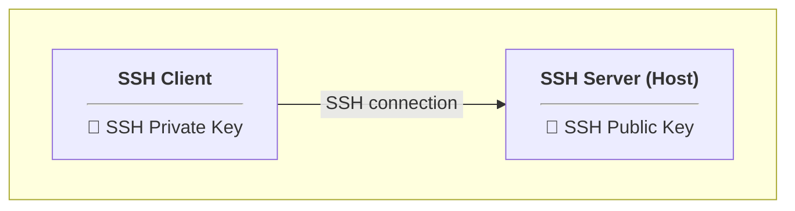

# SSH Access for root in a Proxmox LXC

:information_source: For Debian/Ubuntu

## Overview:



## 0️⃣ On both SSH server (host) and client LXCs:

- #### Install SSH (if not already installed)

  ```bash
  apt update
  apt install openssh-server -y
  systemctl enable ssh
  systemctl start ssh
  ```

---

## 1️⃣ On SSH server (host) LXC:

- #### Allow SSH root login with password

  ```bash
  nano /etc/ssh/sshd_config
  ```

  Set:  
  ```
  PermitRootLogin yes
  PasswordAuthentication yes
  ```

- #### Restart SSH

  ```bash
  systemctl restart ssh
  ```

- #### Test SSH connection  

  From any client (e.g. Windows CMD/PowerShell):  

  ```bash
  ssh -p <port> root@<host-lxc-ip-address>
  ```
  👉 To use the default SSH port, either set `<port>` to `22` or omit the `-p <port>` option entirely

---

## 2️⃣ On SSH client LXC:

- #### Optional: Generate new SSH keys (e.g. in `/root/.ssh/`)

  ```bash
  ssh-keygen -t ed25519 -f /root/.ssh/<key-name> -N "" -C "<key-comment>"
  ```

  ➜ The keys will be created in `/root/.ssh/`
  ```
  /root
    └── .ssh
          ├── <key-name>
          └── <key-name>.pub
  ```

- #### Copy public SSH key to SSH server (host)

  ```bash
  ssh-copy-id -p <port> -i /root/.ssh/<key-name>.pub -s root@<host-lxc-ip-address>
  ```
  👉 To use the default SSH port, either set `<port>` to `22` or omit the `-p <port>` option entirely

  ➜ The public key will be added to `/root/.ssh/authorized_keys`

- #### Test SSH connection

  ```bash
  ssh -p <port> -i /root/.ssh/<key-name> root@<host-lxc-ip-address>
  ```
  👉 To use the default SSH port, either set `<port>` to `22` or omit the `-p <port>` option entirely

- #### Set up SSH shortcut

  ```bash
  nano /root/.ssh/config
  ```

  Add:  
  ```
  Host <host-shortcut-name>
      HostName <host-lxc-ip-address>
      User root
      IdentityFile /root/.ssh/<key-name>
      Port <port>
  ```
  👉 To use the default SSH port, either set `<port>` to `22` or omit the `Port <port>` option entirely

- #### Test SSH connection

  ```bash
  ssh <host-shortcut-name>
  ```

---

## 3️⃣ On SSH server (host) LXC:

- #### Allow SSH root login with key only

  ```bash
  nano /etc/ssh/sshd_config
  ```

  Set:  
  ```
  PermitRootLogin prohibit-password
  # PasswordAuthentication yes
  ```

- #### Restart SSH

  ```bash
  systemctl restart ssh
  ```
